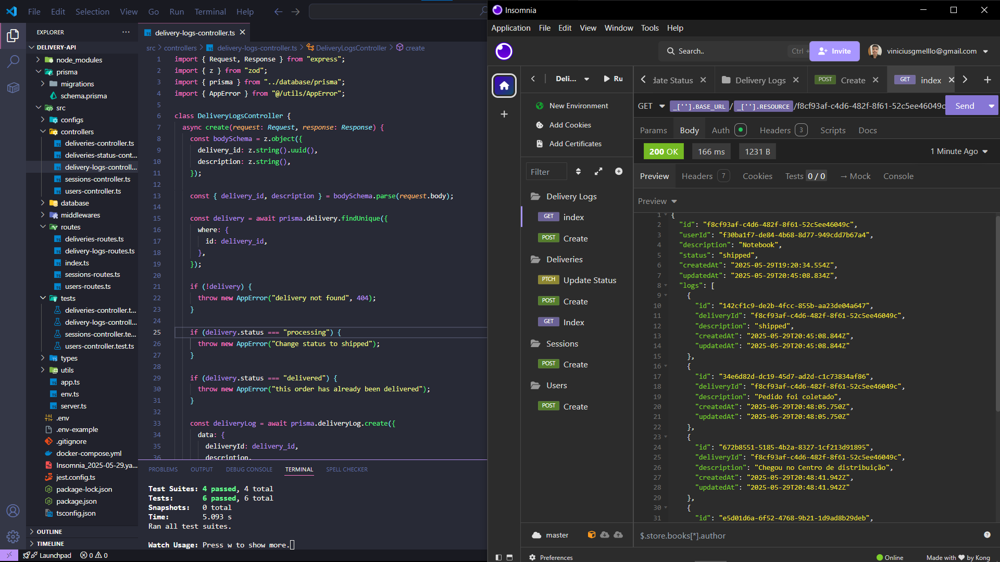

# 📦 Delivery API

Uma API RESTful desenvolvida com **Node.js + TypeScript** para gerenciar um sistema de entregas, com foco em autenticação e autorização, controle de acesso por perfis, registro de pedidos e histórico de movimentações.

---

## 🚀 Visão Geral

A **Delivery API** é uma solução completa para sistemas de entregas com dois tipos de usuários:

- **Vendedor (`sale`)**: responsável por criar pedidos, atualizar status, e criar log da entrega do pedido.
- **Cliente (`customer`)**: pode visualizar os pedidos e acompanhar o andamento.

A API permite:

- Cadastro e login de usuários com perfis distintos
- Autenticação e autorização via **JWT**
- Registro e atualização de pedidos com status:
  - `processing`, `shipped`, `delivered`
- Registro de **logs completos de movimentações** dos pedidos

---

## 🧭 Fluxo da Aplicação

> Representação visual do fluxo principal da API de entregas (cadastro, login, criação e acompanhamento de pedidos):

.png>)

---

## 🗂️ Estrutura do Banco de Dados

> Diagrama das tabelas e seus relacionamentos no banco de dados PostgreSQL:

.png>)

---

## 🗂️ Preview da Aplciação

## 🛠️ Tecnologias Utilizadas

- **Node.js + TypeScript**
- **Express** (com `express-async-errors`)
- **PostgreSQL** (via Docker)
- **Prisma ORM**
- **JWT** para autenticação
- **bcrypt** para hashing de senhas
- **Zod** para validação de dados
- **Jest + SuperTest** para testes automatizados

Ferramentas auxiliares:

- **Docker** (container PostgreSQL)
- **Prisma Studio**
- **Insomnia** (testador de API)

---

## 🧠 Estrutura Modular

- **Controladores organizados por domínio de responsabilidade** (`controllers`)
- **Rotas divididas por recurso** (`users`, `deliveries`, `sessions`, `logs`)
- **Middlewares reutilizáveis** para autenticação, autorização e tratamento de erros
- **Organização clara** que facilita manutenção, testes e escalabilidade
